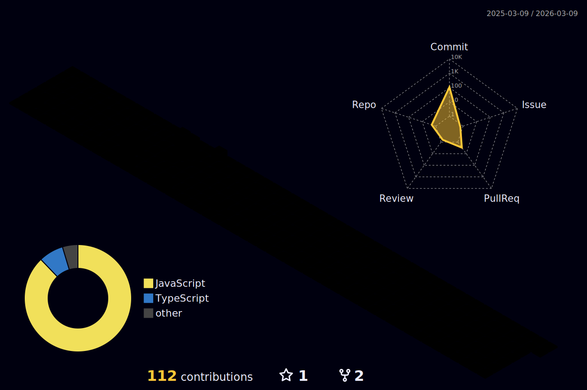

        

  
  <h1 align="center">Hi 👋, I'm Jayesh Joshi</h1>

    

 
  Visitor count 
  

  
  
- 🔭 I’m currently working on **Tech AI Chat Bot**

- 🌱 I’m currently learning **Python Libraries, Java, DSA**

- 📫 How to reach me **divyeshjoshi7474@gmail.com**

- ⚡ Fun fact: I use tabs over spaces  
  

   

# 💻 Tech Stack:

</td></tr></table>  

   

## Connect with me  

  
  
  
  

  

   

## Github Stats

 
   

# Badges
  

  
## 🏆 GitHub Trophies

---

<!-- Proudly created with GPRM ( https://gprm.itsvg.in ) -->
   

 

----
