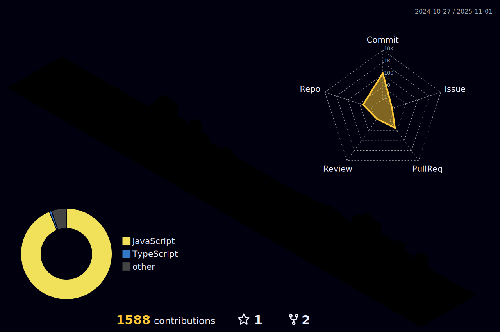

        
<div align="center">

</div>  
  <h1 align="center">Hi 👋, I'm Jayesh Joshi</h1>
<p align='center' style='margin: 14px 11px 9px;'>
    
</p>
<p align="center"> 
  Visitor count<br><br/>  
  
</p>
<!-- Matrix Rain Effect -->
  
  


```yaml
name: Jayesh Joshi
located_in: India 🇮🇳
current_Role: Full Stack Developer
education: ["Self-Taught", "Continuous Learner"]
mission: Building the future, one line at a time

fields_of_interests: ["Web Development", "Mobile App Development"]
currently_learning: ["Python Libraries", "Java", "DSA"]
hobbies: ["Coding", "Open Source"]
```

<div align="center"></div>  

  
- 📫 How to reach me **divyeshjoshi7474@gmail.com**

- ⚡ Fun fact: I use tabs over spaces  
  

<br/>  


# 💻 Tech Stack:
[](https://skillicons.dev)


</td></tr></table>  

<br/>  


## Connect with me  
<div align="center">
  <!-- Animated Social Links -->
 
  <a href="https://www.linkedin.com/in/jayesh-joshi-1b7261250/">
    
  </a>
  <a href="https://twitter.com/jayeshj74">
    
  </a>
  <a href="https://www.instagram.com/jayesh._.joshi__/">
    
  </a>
</div>


  

<br/>  


📊 GitHub Analytics
<div align="center">
  <!-- GitHub Stats Cards -->
  
  
</div>
<div align="center">
  
<div align="center">
  
</div>

# Badges
  
[](https://holopin.io/@jayesh2474)


  
## 🏆 GitHub Trophies
  <!-- GitHub Trophies -->
  

---



<!-- Proudly created with GPRM ( https://gprm.itsvg.in ) -->
<br/>  


<br />

----
